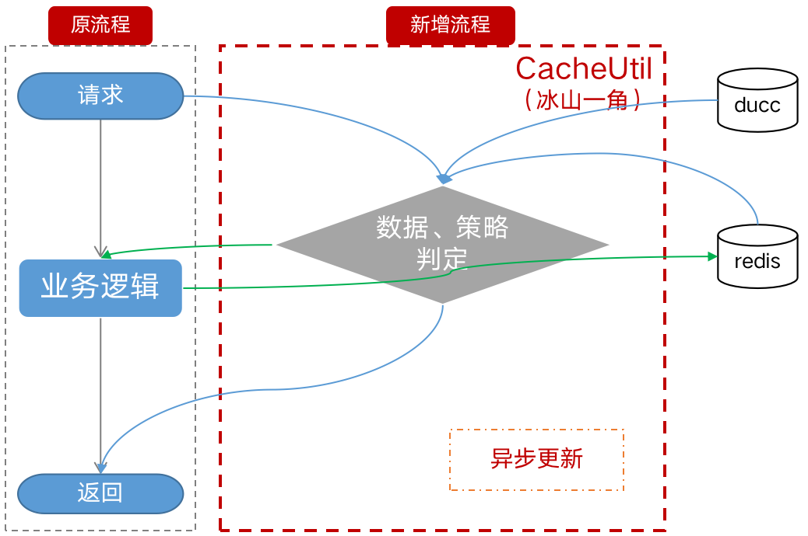
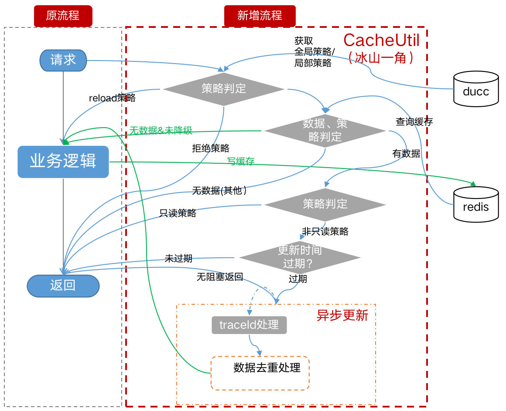

总览见 [epx-tools](../README.md)

[TOC]

# epx-tool-cache 缓存组件

## 零、方案设计
* 1、默认策略简版
  
* 2、核心流程
  

## 一、步骤
### 1.1 引入依赖
```xml
<dependency>
  <groupId>cn.hc</groupId>
  <artifactId>hc-redis-spring-boot-starter</artifactId>
  <version>1.0-SNAPSHOT</version>
</dependency>
```


## 二、配置
### 2.1 缓存策略
```java
public enum CacheStrategyEnum {
    /**
     * 未降级
     */
    ALL_OPEN(1, "未降级"),
    /**
     * 只从reloadTask获取数据
     */
    RELOAD_ONLY(2, "只从reloadTask获取数据"),
    /**
     * 只从缓存获取数据
     */
    CACHE_ONLY(3, "只从缓存获取数据"),
    /**
     * 逻辑过期：只从缓存获取数据，异步写数据
     */
    CACHE_ONLY_AND_ASYNC_WRITE(4, "逻辑过期：只从缓存获取数据，异步写数据"),
    /**
     * 直接返回
     */
    REJECT(5, "直接返回");
}
```

### 2.2 枚举
```java
@Getter
public enum CacheKey implements CacheConf {
  SKU_INFO("sku_info", "sku_info_{0}", TimeConstant.FIVE_MINUTE_OF_SECOND, TimeConstant.ONE_MINUTE_OF_SECOND),
  SKU_INFO2("sku_info2", "sku_info2_{0}", TimeConstant.FIVE_MINUTE_OF_SECOND, TimeConstant.ONE_MINUTE_OF_SECOND, TimeConstant.ONE_MINUTE_OF_SECOND),
  ;
  CacheKey(String confKey, String keyExp, int expire, int update) {
    this(confKey, keyExp, expire, update, 0);
  }
  CacheKey(String confKey, String keyExp, int expire, int update, int randomRange) {
    this.confKey = confKey;
    this.keyExp = keyExp;
    this.expire = expire;
    this.update = update;
    this.randomRange = randomRange;
  }
  /**
   * 加载数据配置名称，也是动态配置中缓存开关
   */
  private final String confKey;
  /**
   * 缓存key表达式，支持类型{0}占位符
   */
  private final String keyExp;
  /**
   * 缓存数据过期时间（秒）
   */
  private final int expire;
  /**
   * 缓存数据后台自动刷新时间间隔，小于等于0表示不自动刷新（秒）
   */
  private final int update;
  /**
   * 随机时间范围
   */
  private final int randomRange;
}
```

### 2.3 异常处理
>> 可自行catch`ToolCacheException`


## 三、功能-缓存工具类
### 3.1 单值缓存 get
#### 3.1.1 带缓存任务
* 方法介绍
```java
/**
 * @param cacheConf  缓存key枚举
 * @param reloadTask 缓存未命中加装数据的任务
 * @param keyParams  生成完整缓存key需要的参数
 * @return
 */
String get(CacheConf cacheConf, Callable<String> reloadTask, Object... keyParams);
```
* 使用示例一
```java
Integer category = 2;
Integer val = cacheUtil.get(CacheKey.SEA_ITEM_CATEGORY, () -> category + 1, category);
```
* 使用示例二
```java
List<VenderShopStoreVo> list = itemCacheUtil.get(CacheKey.PRODUCT_LS_SHOP,
        () -> venderRpc.getShopStoreBySpu(Arrays.asList(ids)), idvo.getSpuId());
```

#### 3.1.2 自定义类型的带缓存任务
* 方法介绍
```java
/**
 * @param cacheConf  缓存key枚举
 * @param vClass     返回类型
 * @param reloadTask 缓存未命中加装数据的任务
 * @param <V>        返回结果数据类型
 * @return
 */
<V> V get(CacheConf cacheConf, Class<V> vClass, Callable<V> reloadTask, Object... keyParams);
```
* 使用示例一
```java
Integer category = 2;
Integer val = cacheUtil.get(CacheKey.SEA_ITEM_CATEGORY, Integer.class, () -> category + 1, category);
```
* 使用示例二
```java
StickerVO stickerVO = itemCacheUtil.get(CacheKey.WARE_STICKER_BY_MARKER, StickerVO.class,
        () -> stickerJsfService.getWareStickerByMarkIdAndValue(WareMarkConstant.STICKER, sticker), sticker.getId());
```

#### 3.1.3 结果数据是否缓存，缓存任务（基于3.1.1，新增判断是否缓存数据结果）
* 方法介绍
```java
/**
 * @param cacheConf  缓存key枚举
 * @param vClass     返回类型
 * @param reloadTask 缓存未命中加装数据的任务
 * @param predicate  是否缓存子句
 * @param keyParams  生成完整缓存key需要的参数
 * @param <V>        返回结果数据类型
 * @return
 */
<V> V get(CacheConf cacheConf, Class<V> vClass, Callable<V> reloadTask, Predicate<V> predicate, Object... keyParams);
```
* 使用示例
```java
Integer category = 2;
Integer val = cacheUtil.get(CacheKey.SEA_ITEM_CATEGORY, () -> category + 1, v -> v > 0, category);
```

### 3.2 批量缓存 基于List getFromList
#### 3.2.1 批量缓存
* 方法介绍
```java
/**
 * 批量缓存
 *
 * @param cacheConf  缓存key枚举
 * @param vClass     返回类型
 * @param reloadTask 缓存未命中加装数据的任务
 * @param keyParams  生成完整缓存key需要的参数
 * @param <K>        加载任务的入参类型
 * @param <V>        返回结果数据类型
 * @return List结果集
 */
<K, V> List<V> getFromList(CacheConf cacheConf, Class<V> vClass, Function<List<K>, List<V>> reloadTask, List<K> keyParams);
```
* 使用示例一
```java
List<Integer> list = Arrays.asList(6, 7);
List<Integer> val = cacheUtil.getFromList(CacheKey.SKU_INFO2, Integer.class, (l) -> {
    List<Integer> res = new ArrayList<>();
    for (Integer k : l) {
      res.add(k + 1);
    }
    return res;
}, list);
```
* 使用示例二
```java
List<BasicDistrictDTO> rst = cacheUtil.getFromList(CacheKey.DISTRICT_LIST, BasicDistrictDTO.class, (ps) -> {
    List<BasicDistrictDO> list = super.list(new QueryWrapper<BasicDistrictDO>().lambda()
            .in(BasicDistrictDO::getAdcode, new LinkedHashSet<>(ps)));
    return districtConverter.toDTO(list);
}, codes);
```

### 3.3 批量缓存 基于set getListFromSet
#### 3.3.1 入参Set批量缓存：基于3.2.1，Set维度入参
* 方法介绍
```java
/**
 * 批量缓存
 *
 * @param cacheConf  缓存key枚举
 * @param vClass     返回类型
 * @param reloadTask 缓存未命中加装数据的任务
 * @param keyParams  生成完整缓存key需要的参数
 * @param <V>        返回结果数据类型
 * @param <P>        加载任务的入参类型
 */
public <V, P> List<V> getListFromSet(CacheConf cacheConf, Class<V> vClass, Function<Set<P>, List<V>> reloadTask, Set<P> keyParams);
```
* 使用示例一
```java
Set<Integer> set = Sets.set(11, 12);
List<Integer> val = cacheUtil.getListFromSet(CacheKey.SKU_INFO2, Integer.class, (p) -> {
    List<Integer> res = new ArrayList<>();
    for (Integer k : p) {
      res.add(k + 1);
    }
    return res;
}, set);
```
* 使用示例二
```java
List<Integer> val = cacheUtil.getListFromSet(CacheKey.DISTRICT_LIST, BasicFieldDTO.class, (p) -> {
    List<BasicFieldDO> list = super.listByIds(p);
    return fieldConverter.toDTO(list);
}, idSet);
```

### 3.4 批量缓存 返回Map getMapFromList
#### 3.4.1 List2Map批量缓存：基于3.2.1，出参map
* 方法介绍
```java
/**
 * 批量缓存
 *
 * @param cacheConf  缓存key枚举
 * @param vClass     返回类型
 * @param reloadTask 缓存未命中加装数据的任务
 * @param keyParams  生成完整缓存key需要的参数
 * @param <V>        返回结果数据类型
 * @param <K>        加载任务的入参类型
 * @return Map<K, V>
 */
public <K, V> Map<K, V> getMapFromList(CacheConf cacheConf, Class<V> vClass, Function<List<K>, Map<K, V>> reloadTask,
                                       List<K> keyParams);
```
* 使用示例
```java
List<Integer> list = Arrays.asList(16, 20);
Map<Integer, Integer> val = cacheUtil.getMapFromList(CacheKey.SKU_INFO2, Integer.class, (p) -> {
    Map<Integer, Integer> res = new HashMap<>();
    for (Integer k : p) {
      res.put(k, k + 1);
    }
    return res;
}, list);
```

### 3.5 批量缓存 返回Map getMapFromSet
#### 3.5.1 Set2Map批量缓存：同3.4.1，入参Set
* 方法介绍
```java
/**
 * 批量缓存
 *
 * @param cacheConf    缓存key枚举
 * @param vClass       返回类型
 * @param reloadTask   缓存未命中加装数据的任务
 * @param keyParams    生成完整缓存key需要的参数
 * @param <V>          返回结果数据类型
 * @param <K>          map的key类型
 * @return Map<K, V>
 */
public <K, V> Map<K, V> getMapFromSet(CacheConf cacheConf, Class<V> vClass, Function<Set<K>, Map<K, V>> reloadTask,
                                      Set<K> keyParams);
```
* 使用示例一
```java
Set<Integer> list = Sets.set(21, 22);
Map<Integer, Integer> val = cacheUtil.getMapFromSet(CacheKey.SKU_INFO2, Integer.class, (l) -> {
    Map<Integer, Integer> res = new HashMap<>();
    for (Integer k : l) {
      res.put(k, k + 1);
    }
    return res;
}, list);
```
* 使用示例二
```java
// 批量缓存赠品
Map<String, Image> imgMultipleMap = idCacheUtil.getMapFromSet(CacheKey.PRODUCT_IMAGE, Image.class,
        l -> idProductRpc.getSkuImgBySkuId(l), skuIds);
```


## 四、功能-锁工具

### 4.1 锁失败指定异常
* 方法介绍
```java
/**
 * 分布式锁执行方法
 *
 * @param cacheConf 缓存配置
 * @param callback  方法体
 * @param error     生成指定异常的方法体
 * @param keyParams 生成完整缓存key需要的参数
 * @param <T>       泛型
 * @return 方法体执行结果
 */
public <T, E extends Exception> T execute(CacheConf cacheConf, Callable<T> callback, Callable<E> error, Object... keyParams);
```
* 使用示例
```java
Long val = lockUtil.execute(CacheKey.LOCK_INIT_BIZ_ORG, () -> bizOrgService.initBizOrg(req),
                () -> new BizException(AuthErrorEnums.ERROR_INIT_BIZ_ORG_CONCURRENCY),
                req.getAccountId());
```

### 4.2 锁失败抛出默认异常 ToolCacheException
* 方法介绍
```java
/**
 * 分布式锁执行方法,释放锁
 *
 * @param cacheInterface 缓存配置
 * @param callback       方法体
 * @param <T>            泛型
 * @return 方法体执行结果
 */
public <T, E extends Exception> T execute(CacheConf cacheInterface, Func<T> callback, Object... keyParams);
```
* 使用示例
```java
Long val = epxLockUtil.execute(CacheKey.LOCK_INIT_BIZ_ORG, () -> bizOrgService.initBizOrg(req),
                req.getAccountId());
```


## 五、高级配置

### 5.1 接配置中心 动态配置缓存过期时间 `${cacheConf}-expire`
```text
// ducc配置 缓存过期时间1天（精确到秒）
sea_item_category-expire=86400
```

### 5.2 接配置中心 动态配置缓存更新时间 `${cacheConf}-update`
```text
// ducc配置 缓存过期时间5分钟（精确到秒）
sea_item_category-update=300
```